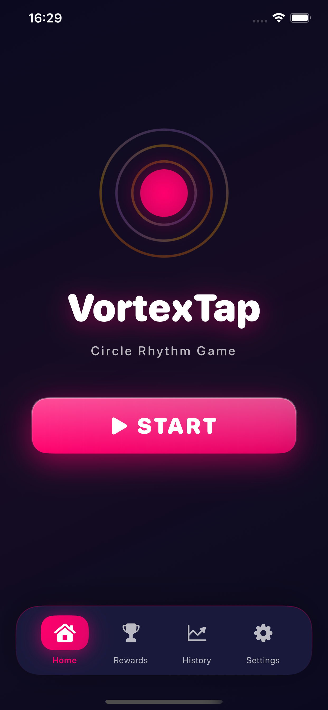
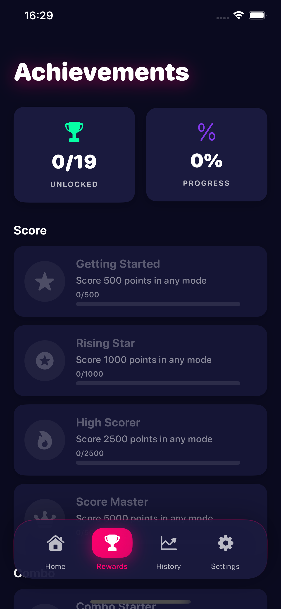
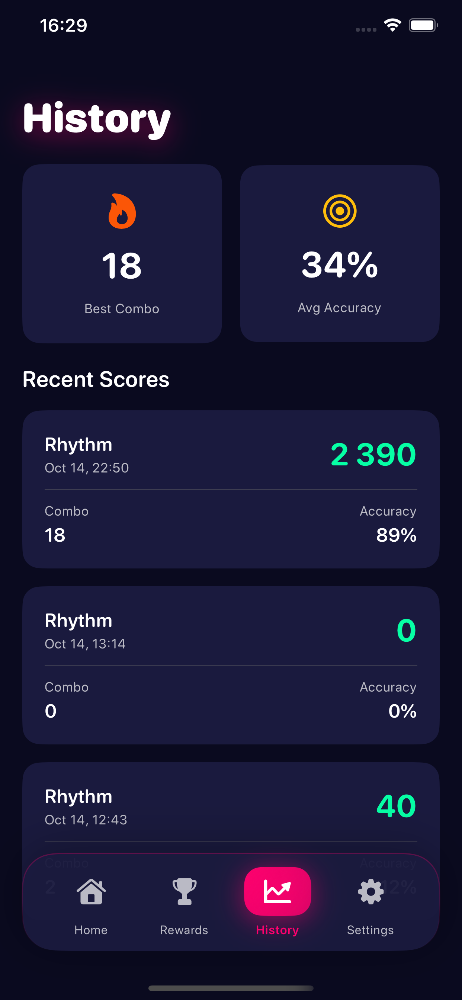
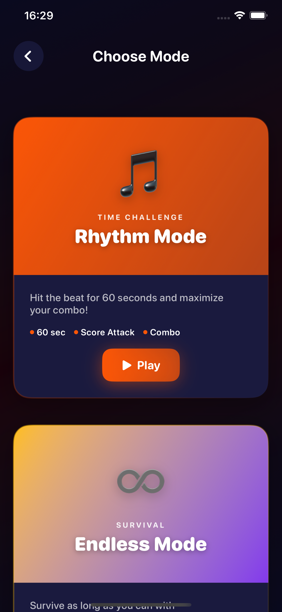
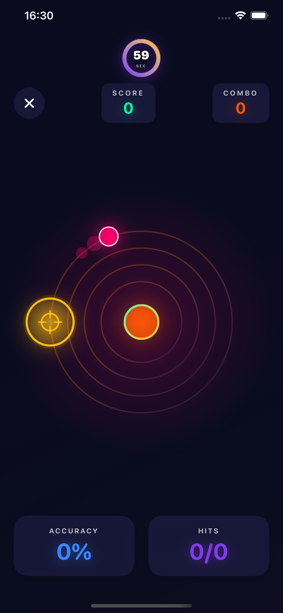

# VortexTap 🌀

Ритм-игра для iOS. Три режима, достижения, две темы.

---

## Скриншоты

<p align="center">
  
  
  
</p>
<p align="center">
  
  
</p>

---

## О проекте

- **Rhythm Mode** — 60 сек, цель в 8 позициях по кругу
- **Endless Mode** — 3 жизни, ускорение от комбо
- **Orbital Mode** — 45 сек, 4 орбиты, переключение кнопками

19 достижений, темы Vortex/Pulse, тактильная отдача, история игр.

**Стек:** SwiftUI, MVVM, Combine · **iOS 15+**

---

## Запуск

```bash
open VortexTap.xcworkspace
# В Xcode: ⌘R
```
